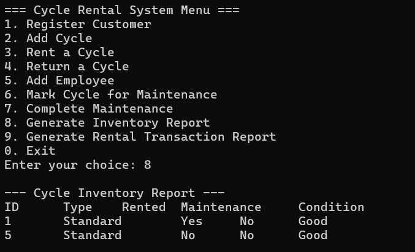

# Cycle Rental System

A terminal-based cycle rental system designed to log customer data, manage rental transactions, and support employee management for business scalability. The project is modularized into multiple modules (models, controllers, data, and utilities) to ensure easy maintenance and extensibility.

## Features

- **Customer Management:**  
  Register customers and log their details.

- **Cycle Rental and Return:**  
  Rent cycles to customers with robust error handling to prevent double-booking. Rental transactions record start/end times, hours, and cost.

- **Employee Management:**  
  Manage employee details to support business growth.

- **Maintenance Tracking:**  
  Mark cycles for maintenance and complete maintenance operations.

- **Reporting:**  
  Generate inventory and rental transaction reports.

## Installation

### Clone the Repository

```bash
git clone https://github.com/Nitesh3000/CycleRentalSystem.git
cd CycleRentalSystem
```

### Dependencies

- **C++ Compiler:**  
  A compiler supporting C++11 or later (e.g., Visual Studio, GCC, or Clang).

- **SQLite3 Library:**  
  Ensure SQLite3 is installed. On Windows, you can use vcpkg:

  ```bash
  vcpkg install sqlite3:x64-windows
  ```

- **(Optional) Visual Studio:**  
  For Windows users who prefer an IDE.


## Usage

The terminal-based menu provides options to:

- Register a customer.
- Add a cycle.
- Rent and return a cycle.
- Add an employee.
- Mark and complete maintenance.
- Generate inventory and rental transaction reports.

The system includes comprehensive input validation and error handling (e.g., preventing renting an already rented cycle).

## Project Structure

```
Cycle Rental System/
├── include/
│   ├── controllers/       # Header files for controllers (Customer, Employee, Rental, Maintenance)
│   ├── data/              # Database interface header file
│   ├── models/            # Data models (Customer, Cycle, RentalTransaction, Employee, Payment)
│   └── utils/             # Utility headers (Logger, ReportGenerator)
└── src/
    ├── controllers/       # Implementation files for controllers
    ├── data/              # Database implementation
    ├── models/            # Model implementation files
    ├── utils/             # Utility implementation files
    └── main.cpp           # Main application with terminal-based UI
```
## Screenshots

Customer Registration


Cycle Registration


Maintenance Tracking


Transactions

## Future Enhancements

- Integration of a GUI for improved user experience.
- Enhanced reporting with graphical outputs.
- Additional business logic for dynamic pricing or subscription-based rentals.

## Contributing

Contributions, bug reports, and feature requests are welcome! Please fork the repository and submit a pull request.

